# Class Diagram SPMB Online

Diagram ini memakai tabel aktif yang digunakan aplikasi saat ini. Tabel legacy dengan nama jamak seperti `pendaftars`, `jurusans`, dan `users` tidak dimasukkan karena bukan tabel yang dipakai model utama aplikasi.

```mermaid
classDiagram
    class Pengguna {
        +int id_pengguna PK
        +int id_peran FK
        +string name
        +string phone
    }
    class Peran {
        +int id_peran PK
        +string name
    }
    class Pendaftar {
        +int id_pendaftar PK
        +int id_pengguna FK
        +int id_tahun_ajaran FK
        +int id_jalur_pendaftaran FK
        +int id_gelombang_pendaftaran FK
        +int id_jurusan_pilihan_1 FK
        +int id_jurusan_pilihan_2 FK
        +string registration_status
    }
    class TahunAjaran {
        +int id_tahun_ajaran PK
        +string name
    }
    class JalurPendaftaran {
        +int id_jalur_pendaftaran PK
        +string name
    }
    class GelombangPendaftaran {
        +int id_gelombang_pendaftaran PK
        +int id_tahun_ajaran FK
        +string name
        +date start_date
        +date end_date
        +string status
    }
    class GelombangJurusan {
        +int id_gelombang_jurusan PK
        +int id_gelombang_pendaftaran FK
        +int id_jurusan FK
        +decimal biaya_masuk
        +json rincian_biaya
    }
    class Jurusan {
        +int id_jurusan PK
        +string name
        +string code
        +int quota
        +decimal biaya_masuk
        +string status
    }
    class BiodataPendaftar {
        +int id_biodata_pendaftar PK
        +int id_pendaftar FK UK
        +string full_name
        +string nisn
        +date birth_date
    }
    class AlamatPendaftar {
        +int id_alamat_pendaftar PK
        +int id_pendaftar FK UK
        +string address
        +string province
        +string city
    }
    class DataAyah {
        +int id_data_ayah PK
        +int id_pendaftar FK UK
        +string name
        +string occupation
    }
    class DataIbu {
        +int id_data_ibu PK
        +int id_pendaftar FK UK
        +string name
        +string occupation
    }
    class DataWali {
        +int id_data_wali PK
        +int id_pendaftar FK UK
        +string name
        +string occupation
    }
    class SekolahAsal {
        +int id_sekolah_asal PK
        +int id_pendaftar FK UK
        +string school_name
    }
    class KontakPendaftar {
        +int id_kontak_pendaftar PK
        +int id_pendaftar FK UK
        +string phone
        +string email
    }
    class DokumenPendaftar {
        +int id_dokumen_pendaftar PK
        +int id_pendaftar FK
        +int id_jenis_dokumen FK
        +int id_pengguna_verifikator FK
        +string status
        +string file_path
    }
    class JenisDokumen {
        +int id_jenis_dokumen PK
        +string name
        +boolean is_required
    }
    class HasilSeleksi {
        +int id_hasil_seleksi PK
        +int id_pendaftar FK UK
        +int id_jurusan FK
        +int id_pengguna_pengambil_keputusan FK
        +string status
        +datetime decided_at
    }
    class JenisTagihan {
        +int id_jenis_tagihan PK
        +string name
        +decimal default_amount
    }
    class TagihanPendaftar {
        +int id_tagihan_pendaftar PK
        +int id_pendaftar FK
        +int id_jenis_tagihan FK
        +decimal total_amount
        +decimal paid_amount
        +decimal remaining_amount
        +json rincian_biaya
        +string status
    }
    class TransaksiPembayaran {
        +int id_transaksi_pembayaran PK
        +int id_tagihan_pendaftar FK
        +int id_pengguna_verifikator FK
        +decimal amount
        +string payment_method
        +string status
    }
    class JadwalSpmb {
        +int id_jadwal_spmb PK
        +int id_tahun_ajaran FK
        +string kegiatan
        +datetime tanggal_mulai
    }
    class TesMasuk {
        +int id_tes_masuk PK
        +string test_name
        +date test_date
    }
    class PesertaTes {
        +int id_peserta_tes PK
        +int id_pendaftar FK
        +int id_jadwal_spmb FK
        +int id_tes_masuk FK
        +decimal score
        +boolean attendance
    }
    class KunjunganPendaftar {
        +int id_kunjungan_pendaftar PK
        +int id_pendaftar FK
        +int id_jurusan_minat FK
        +int id_pengguna_penerima FK
        +datetime visited_at
    }
    class PrestasiPendaftar {
        +int id_prestasi_pendaftar PK
        +int id_pendaftar FK
        +string title
        +string level
    }
    class RiwayatStatusPendaftar {
        +int id_riwayat_status_pendaftar PK
        +int id_pendaftar FK
        +int id_pengguna_pengubah FK
        +string status_lama
        +string status_baru
    }

    Peran "1" --> "0..*" Pengguna : memiliki
    Pengguna "1" --> "0..1" Pendaftar : akun siswa
    TahunAjaran "1" --> "0..*" Pendaftar : menaungi
    JalurPendaftaran "1" --> "0..*" Pendaftar : dipilih
    GelombangPendaftaran "1" --> "0..*" Pendaftar : diikuti
    TahunAjaran "1" --> "0..*" GelombangPendaftaran : memiliki
    GelombangPendaftaran "1" --> "0..*" GelombangJurusan : mengatur biaya
    Jurusan "1" --> "0..*" GelombangJurusan : memiliki biaya
    Jurusan "1" --> "0..*" Pendaftar : pilihan 1
    Jurusan "1" --> "0..*" Pendaftar : pilihan 2

    Pendaftar "1" --> "0..1" BiodataPendaftar : biodata
    Pendaftar "1" --> "0..1" AlamatPendaftar : alamat
    Pendaftar "1" --> "0..1" DataAyah : ayah
    Pendaftar "1" --> "0..1" DataIbu : ibu
    Pendaftar "1" --> "0..1" DataWali : wali opsional
    Pendaftar "1" --> "0..1" SekolahAsal : sekolah asal
    Pendaftar "1" --> "0..1" KontakPendaftar : kontak
    Pendaftar "1" --> "0..*" DokumenPendaftar : mengunggah
    JenisDokumen "1" --> "0..*" DokumenPendaftar : tipe dokumen
    Pengguna "1" --> "0..*" DokumenPendaftar : memverifikasi

    Pendaftar "1" --> "0..1" HasilSeleksi : hasil seleksi
    Jurusan "1" --> "0..*" HasilSeleksi : jurusan diterima
    Pengguna "1" --> "0..*" HasilSeleksi : memutuskan

    Pendaftar "1" --> "0..*" TagihanPendaftar : memiliki tagihan
    JenisTagihan "1" --> "0..*" TagihanPendaftar : jenis tagihan
    TagihanPendaftar "1" --> "0..*" TransaksiPembayaran : dibayar melalui
    Pengguna "1" --> "0..*" TransaksiPembayaran : memverifikasi

    TahunAjaran "1" --> "0..*" JadwalSpmb : memiliki jadwal
    Pendaftar "1" --> "0..*" PesertaTes : mengikuti
    JadwalSpmb "1" --> "0..*" PesertaTes : sesi
    TesMasuk "1" --> "0..*" PesertaTes : jenis tes

    Pendaftar "1" --> "0..*" KunjunganPendaftar : kunjungan
    Jurusan "1" --> "0..*" KunjunganPendaftar : minat jurusan
    Pengguna "1" --> "0..*" KunjunganPendaftar : menerima
    Pendaftar "1" --> "0..*" PrestasiPendaftar : prestasi
    Pendaftar "1" --> "0..*" RiwayatStatusPendaftar : riwayat status
    Pengguna "1" --> "0..*" RiwayatStatusPendaftar : mengubah
```

## Kardinalitas penting

    - Semua primary key dan foreign key pada diagram diberi nama eksplisit berbentuk `id_nama_entitas` agar tidak ambigu.
    - `Pendaftar` — `BiodataPendaftar`, `AlamatPendaftar`, `DataAyah`, `DataIbu`, `SekolahAsal`, dan `KontakPendaftar`: **1 : 0..1**.
- `Pendaftar` — `DataWali`: **1 : 0..1**, karena wali opsional.
- `Pendaftar` — `DokumenPendaftar`, `TagihanPendaftar`, `TransaksiPembayaran`, `PesertaTes`, `KunjunganPendaftar`, dan `RiwayatStatusPendaftar`: **1 : N**.
- `GelombangPendaftaran` — `Jurusan`: secara konsep **N : M**, direalisasikan oleh tabel penghubung `GelombangJurusan` yang menyimpan biaya dan rincian biaya.
- `Pendaftar` — `Jurusan`: `major_choice_1` dan `major_choice_2` adalah dua relasi **N : 1** terpisah ke tabel `Jurusan`.
    - Nama eksplisit tersebut adalah nama logis untuk diagram. Kolom database asli tetap menggunakan nama seperti `id`, `applicant_id`, `major_id`, dan `user_id`.
    - Tabel jamak seperti `pendaftars`, `jurusans`, dan `users` adalah tabel legacy/duplikat dan tidak dipakai oleh model aktif utama.
